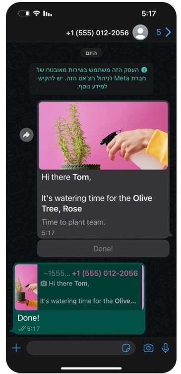
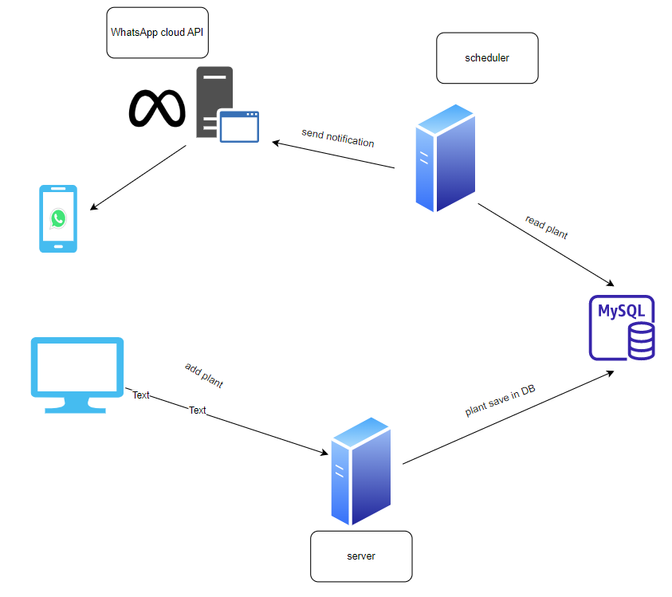
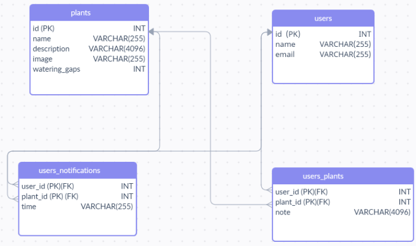

# TimeToPlant

link to presentation:

https://www.canva.com/design/DAFQMPLDfy4/-bQBAR98sIKvNQabsmMNsw/view?utm_content=DAFQMPLDfy4&utm_campaign=designshare&utm_medium=link&utm_source=publishsharelink

## Introduction

Have you ever been able to water and maintain your houseplants for two weeks in a row?

Our solution offers the user an app to manage his houseplants.

This is a full-stack mobile app that sends whatsapp notifications about watering plants, and allows to take notes about the users plants.

## Flow

The user logs in to the home page, where he can choose his house plants from our list of plants, which are stored at our DB.

Then the user can see his plants in the profile page. every 24 hours the user will get a whatsapp notification that will remind him to water his plants.

## Features

- Notes

      The user can add note to each plant, to help organize and keep track of the plant state.

  

- Pause notifications

  The user can stop the notifications in any time, by pressing the pause button, in case he goes to a vacation or for Midbern party.
  

- Search bar

  We implemented a search bar that allows the user to search for plants by their name, more easily.
  

## Tech Workflow

## DB Architecture

